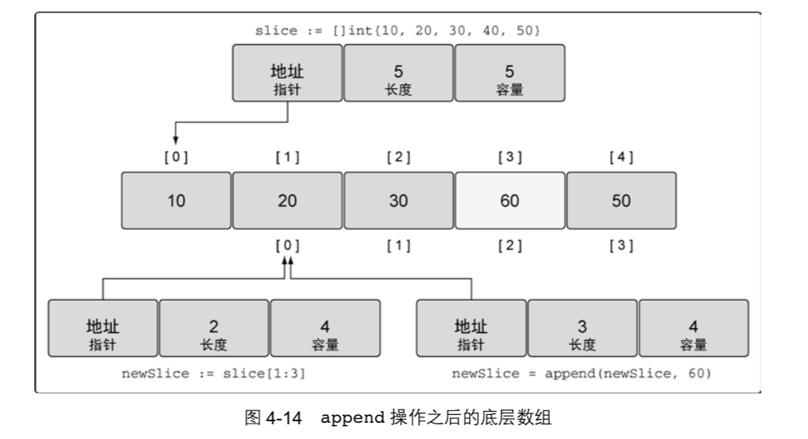

[TOC]

#第 4 章 数组、切片和映射 53


程序：需要存储和读取集合数据

使用数据库或者文件， 或者访问网络，总需要一种方法来处理接收和发送的数据  

Go 语言有 **3 种数据结构**可以让用户 管理集合数据：**数组、切片和映射**。这 3 种数据结构是语言核心的一部分，在标准库里被广泛使 用。一旦学会如何使用这些数据结构，用 Go 语言编写程序会变得快速、有趣且十分灵活。  


##4.1 数组的内部实现和基础功能 53

了解这些数据结构，一般会从数组开始，因为  数组是切片和映射的基础数据结构  	


###4.1.1 内部实现 53

数组占用的内存是连续分配的  


###4.1.2 声明和初始化 54

```go
// 声明一个包含 5 个元素的整型数组
var array [5]int
```

在 Go 语言中声明变量时，总会使用对应类型的零值来对变量进行初始化。  


```go
代码清单 4-2 使用数组字面量声明数组
// 声明一个包含 5 个元素的整型数组
// 用具体值初始化每个元素
array := [5]int{10, 20, 30, 40, 50}+
如果使用...替代数组的长度， Go 语言会根据初始化时数组元素的数量来确定该数组的长
度，如代码清单 4-3 所示。
代码清单 4-3 让 Go 自动计算声明数组的长度
// 声明一个整型数组
// 用具体值初始化每个元素+
// 容量由初始化值的数量决定
array := [...]int{10, 20, 30, 40, 50}
如果知道数组的长度而是准备给每个值都指定具体值，就可以使用代码清单 4-4 所示的这种
语法。
代码清单 4-4 声明数组并指定特定元素的值
// 声明一个有 5 个元素的数组
// 用具体值初始化索引为 1 和 2 的元素
// 其余元素保持零值
array := [5]int{1: 10, 2: 20}
```


###4.1.3 使用数组 55

```go
代码清单 4-5 访问数组元素
// 声明一个包含 5 个元素的整型数组
// 用具体值初始为每个元素
array := [5]int{10, 20, 30, 40, 50}
// 修改索引为 2 的元素的值
array[2] = 35

代码清单 4-6 访问指针数组的元素
// 声明包含 5 个元素的指向整数的数组
// 用整型指针初始化索引为 0 和 1 的数组元素
array := [5]*int{0: new(int), 1: new(int)}
// 为索引为 0 和 1 的元素赋值
*array[0] = 10
*array[1] = 20
代码清单 4-6 中声明的数组的值在操作完毕后，会和图 4-5 所展现的一样。
```


在 Go 语言里，数组是一个值。这意味着数组可以用在赋值操作中。变量名代表整个数组 因此，同样类型的数组可以赋值给另一个数组，如代码清单 4-7 所示  

```go
// 声明第一个包含 5 个元素的字符串数组
var array1 [5]string
// 声明第二个包含 5 个元素的字符串数组
// 用颜色初始化数组
array2 := [5]string{"Red", "Blue", "Green", "Yellow", "Pink"}
// 把 array2 的值复制到 array1
array1 = array2
复制之后，两个数组的值完全一样，如图 4-6 所示。
```


数组变量的类型包括数组长度和每个元素的类型。只有这两部分都相同的数组，才是类型相  同的数组，才能互相赋值，如代码清单 4-8 所示。  


复制数组指针，只会复制指针的值，而不会复制指针所指向的值，如代码清单 4-9 所示  

```go
// 声明第一个包含 3 个元素的指向字符串的指针数
var array1 [3]*string
// 声明第二个包含 3 个元素的指向字符串的指针数组
// 使用字符串指针初始化这个数组
array2 := [3]*string{new(string), new(string), new(string)}
// 使用颜色为每个元素赋值
*array2[0] = "Red"
*array2[1] = "Blue"
*array2[2] = "Green"
// 将 array2 复制给 array1
array1 = array2
复制之后，两个数组指向同一组字符串，如图 4-7 所示。
```


###4.1.4 多维数组 58

```go
代码清单 4-10 声明二维数组
// 声明一个二维整型数组，两个维度分别存储 4 个元素和 2 个元素
var array [4][2]int
// 使用数组字面量来声明并初始化一个二维整型数组
array := [4][2]int{{10, 11}, {20, 21}, {30, 31}, {40, 41}}
// 声明并初始化外层数组中索引为 1 个和 3 的元素
array := [4][2]int{1: {20, 21}, 3: {40, 41}}
// 声明并初始化外层数组和内层数组的单个元素
array := [4][2]int{1: {0: 20}, 3: {1: 41}}
图 4-8 展示了代码清单 4-10 中声明的二维数组在每次声明并初始化后包含的值。
```


只要类型一致，就可以将多维数组互相赋值，如代码清单 4-12 所示。多维数组的类型包括每 一维度的长度以及最终存储在元素中的数据的类型。  


###4.1.5 在函数间传递数组 59

根据内存和性能来看，在**函数间传递数组**是一个**开销很大**的操作。在函数之间传递变量时， 总是以值的方式传递的。如果这个变量是一个数组，意味着整个数组，不管有多长，都会**完整复 制，并传递给函数**  .

```
代码清单 4-14 使用值传递
// 声明一个需要 8 MB 的
var array [1e6]int
// 将数组传递给函数 foo
foo(array)
// 函数 foo 接受一个 100 万个整型值的数组
func foo(array [1e6]int) {
...
}

```

每次函数 foo 被调用时，必须在栈上分配 8 MB 的内存。之后，整个数组的值（8 MB 的内
存）被复制到刚分配的内存里。虽然 Go 语言自己会处理这个复制操作，不过还有一种更好且更
有效的方法来处理这个操作。可以只传入指向数组的指针，这样只需要复制 8 字节的数据而不是
8 MB 的内存数据到栈上，如代码清单 4-15 所示。


```go
代码清单 4-15 使用指针在函数间传递大数组
// 分配一个需要 8 MB 的数组
var array [1e6]int
// 将数组的地址传递给函数 foo
foo(&array)
// 函数 foo 接受一个指向 100 万个整型值的数组的指针
func foo(array *[1e6]int) {
...
}
```

    这次函数 foo 接受一个指向 100 万个整型值的数组的指针。现在将数组的地址传入函数， 只需要在栈上分配 8 字节的内存给指针就可以。 
    
    这个操作会更有效地利用内存，性能也更好。不过要意识到，因为现在传递的是指针， 所以如果改变指针指向的值，会改变共享的内存。如你所见，使用切片能更好地处理这类共 享问题。  

##4.2 切片的内部实现和基础功能 60

切片是一种数据结构，这种数据结构便于使用和管理数据集合。

切片是围绕动态数组的概念 构建的，可以按需自动增长和缩小。

切片的动态增长是通过内置函数 append 来实现的。这个函 数可以快速且高效地增长切片。还可以通过对切片再次切片来缩小一个切片的大小。因为切片的 底层内存也是在连续块中分配的，所以切片还能获得索引、迭代以及为垃圾回收优化的好处  

###4.2.1 内部实现 60

	切片是一个很小的对象，对底层数组进行了抽象，并提供相关的操作方法。切片有 3 个字段 的数据结构，这些数据结构包含 Go 语言需要操作底层数组的元数据（见图 4-9）。
	
	 这 3 个字段分别是**指向底层数组的指针**、切片访问的元素的个数（即**长度**）和切片允许增长 到的元素个数（即**容量**）。后面会进一步讲解长度和容量的区别。  

- [ ] 


###4.2.2 创建和初始化 61

#### 1. make 和切片字面量  

```go
代码清单 4-16 使用长度声明一个字符串切片
// 创建一个字符串切片
// 其长度和容量都是 5 个元素
slice := make([]string, 5)
如果只指定长度，那么切片的容量和长度相等。也可以分别指定长度和容量，如代码清单 4-17
所示。
代码清单 4-17 使用长度和容量声明整型切片
// 创建一个整型切片
// 其长度为 3 个元素，容量为 5 个元素
slice := make([]int, 3, 5)
分别指定长度和容量时，创建的切片，底层数组的长度是指定的容量，但是初始化后并不能
访问所有的数组元素。图 4-9 描述了代码清单 4-17 里声明的整型切片在初始化并存入一些值后的
样子。
```

不允许创建容量小于长度的切片，如代码清单 4-18 所示  

```go
代码清单 4-18 容量小于长度的切片会在编译时报错
// 创建一个整型切片
// 使其长度大于容量
slice := make([]int, 5, 3)

Compiler Error:
len larger than cap in make([]int)
```


	另一种常用的创建切片的方法是使用切片字面量，如代码清单 4-19 所示。这种方法和创建 数组类似，只是不需要指定[]运算符里的值。初始的长度和容量会基于初始化时提供的元素的 个数确定。  

```go
代码清单 4-19 通过切片字面量来声明切片
// 创建字符串切片
// 其长度和容量都是 5 个元素
slice := []string{"Red", "Blue", "Green", "Yellow", "Pink"}
// 创建一个整型切片
// 其长度和容量都是 3 个元素
slice := []int{10, 20, 30}
```

当使用切片字面量时，可以设置初始长度和容量。要做的就是在初始化时给出所需的长 度和容量作为索引。代码清单 4-20 中的语法展示了如何创建长度和容量都是 100 个元素的 切片。  

```go
代码清单 4-20 使用索引声明切片
// 创建字符串切片
// 使用空字符串初始化第 100 个元素
slice := []string{99: ""}
```


	**记住，如果在[]运算符里指定了一个值，那么创建的就是数组而不是切片**。只有不指定值 的时候，才会创建切片，如代码清单 4-21 所示。  

```
代码清单 4-21 声明数组和声明切片的不同
// 创建有 3 个元素的整型数组
array := [3]int{10, 20, 30}
// 创建长度和容量都是 3 的整型切片
slice := []int{10, 20, 30}
```


#### 2.nil 和空切片  

有时，程序可能需要声明一个值为 nil 的切片（也称 nil 切片）。只要在声明时不做任何初化，就会创建一个 nil 切片，如代码清单 4-22 所示  

```go
代码清单 4-22 创建 nil 切片
// 创建 nil 整型切片
var slice []int
```


```go
代码清单 4-23 声明空切片
// 使用 make 创建空的整型切片
slice := make([]int, 0)
// 使用切片字面量创建空的整型切片
slice := []int{}
```

空切片在底层数组包含 0 个元素，也没有分配任何存储空间。想表示空集合时空切片很有用， 例如，数据库查询返回 0 个查询结果时（见图 4-11）。  


不管是使用 nil 切片还是空切片，对其调用内置函数 append、 len 和 cap 的效果都是 一样的。  

###4.2.3 使用切片 63

#### 1． 赋值和切片  

通过 `a[start:end]` 这样的语法创建了一个从 `a[start]` 到 `a[end -1]` 的切片， start从0开始，

```go
代码清单 4-25 使用切片创建切片
// 创建一个整型切片
// 其长度和容量都是 5 个元素
slice := []int{10, 20, 30, 40, 50}
// 创建一个新切片
// 其长度为 2 个元素，容量为 4 个元素
newSlice := slice[1:3]

```


代码清单 4-26 如何计算长度和容量 

对底层数组容量是 k 的切片 ，slice[i:j]来说 

**长度: j - i** 

**容量: k - i**  

```sh
对 newSlice 应用这个公式就能得到代码清单 4-27 所示的数字。
代码清单 4-27 计算新的长度和容量
对底层数组容量是 5 的切片 slice[1:3]来说
长度: 3 - 1 = 2
容量: 5 - 1 = 4
```

	可以用另一种方法来描述这几个值。第一个值表示新切片开始的元素的索引位置，这个例子 中是 1。第二个值表示开始的索引位置（1），加上希望包含的元素的个数（2）， 1+2 的结果是 3， 所以第二个值就是 3。容量是该与切片相关联的所有元素的数量。
	
	 需要记住的是，现在两个切片共享同一个底层数组。如果一个切片修改了该底层数组的共享 部分，另一个切片也能感知到，如代码清单 4-28 所示  

```go
代码清单 4-29 表示索引越界的语言运行时错误
// 创建一个整型切片
// 其长度和容量都是 5 个元素
slice := []int{10, 20, 30, 40, 50}
// 创建一个新切片
// 其长度为 2 个元素，容量为 4 个元素
newSlice := slice[1:3]
// 修改 newSlice 索引为 3 的元素
// 这个元素对于 newSlice 来说并不存在
newSlice[3] = 45
Runtime Exception:
panic: runtime error: index out of range
```

	切片有额外的容量是很好，但是如果不能把这些容量合并到切片的长度里，这些容量就没有 用处。好在可以用 Go 语言的内置函数 append 来做这种合并很容易。  


####2． 切片增长   函数append

	函数 append 总是会增加新切片的长 度，而容量有可能会改变，也可能不会改变，这取决于被操作的切片的可用容量。  



	因为 newSlice 在底层数组里还有额外的容量可用，append 操作将可用的元素合并到切片
的长度，并对其进行赋值。由于和原始的 slice 共享同一个底层数组，slice 中索引为 3 的元素的值也被改动了。

	如果切片的底层数组没有足够的可用容量，append 函数会创建一个新的底层数组，将被引用的现有的值复制到新数组里，再追加新的值，如代码清单 4-31 所示。

```go
代码清单 4-31 使用 append 同时增加切片的长度和容量
// 创建一个整型切片
// 其长度和容量都是 4 个元素
slice := []int{10, 20, 30, 40}
 
// 向切片追加一个新元素
// 将新元素赋值为 50
newSlice := append(slice, 50)
当这个 append 操作完成后，newSlice 拥有一个全新的底层数组，这个数组的容量是原来 的两倍(见图 4-15)。
```


	函数 append 会智能地处理底层数组的容量增长。在切片的容量小于 1000 个元素时，总是
会成倍地增加容量。一旦元素个数超过 1000，容量的增长因子会设为 1.25，也就是会每次增加 25%
的容量。随着语言的演化，这种增长算法可能会有所改变。


#### 3． 创建切片时的 3 个索引  函数append

	在创建切片时，还可以使用之前我们没有提及的第三个索引选项。**第三个索引**可以用来控制
新切片的容量。其目的并不是要增加容量，而是要**限制容量。**

```go
代码清单 4-33 使用 3 个索引创建切片
// 将第三个元素切片，并限制容量
// 其长度为 1 个元素，容量为 2 个元素 slice := source[2:3:4]
```

这个切片操作执行后，新切片里从底层数组引用了 1 个元素，容量是 2 个元素。具体来说， 新切片引用了 Plum 元素，并将容量扩展到 Banana 元素，如图 4-17 所示。


代码清单 4-34 如何计算长度和容量 对于 slice[i:j:k] 或 [2:3:4] 

长度: j – i 或 3 - 2 = 1 

容量: k – i 或 4 - 2 = 2 

和之前一样，第一个值表示新切片开始的元素的索引位置，这个例子中是 2。

第二个值表示
开始的索引位置(2)加上希望包括的元素的个数(1)，2+1 的结果是 3，所以第二个值就是 3。

为了设置容量，从索引位置 2 开始，加上希望容量中包含的元素的个数(2)，就得到了第三个值 4。

```go
代码清单 4-35 设置容量大于已有容量的语言运行时错误
// 这个切片操作试图设置容量为 4 // 这比可用的容量大
slice := source[2:3:6]
Runtime Error:
panic: runtime error: slice bounds out of range
```

	如果在**创建切片**时设置切片的**容量和长度一样**，就可以强制让新切片的第一个 append 操作**创建新的底层数组，与原有的底层数组分离**。新切片与原有的底层数组分离后，可以安全地进行后续修改，如代码清单 4-36 所示。

```go
代码清单 4-36 设置长度和容量一样的好处
// 创建字符串切片
// 其长度和容量都是 5 个元素
source := []string{"Apple", "Orange", "Plum", "Banana", "Grape"}
// 对第三个元素做切片，并限制容量 // 其长度和容量都是 1 个元素 slice := source[2:3:3]
// 向 slice 追加新字符串
slice = append(slice, "Kiwi")
```

	在代码清单 4-36 中我们限制了 slice 的容
量为 1。当我们第一次对 slice 调用 append 的时候，会创建一个新的底层数组，这个数组包
括 2 个元素，并将水果 Plum 复制进来，再追加新水果 Kiwi，并返回一个引用了这个底层数组
的新切片，如图 4-18 所示。


内置函数 append 也是一个可变参数的函数。这意味着可以在一次调用传递多个追加的值。
如果使用...运算符，可以将一个切片的所有元素追加到另一个切片里，如代码清单 4-37 所示。

```go
 代码清单 4-37 将一个切片追加到另一个切片
// 创建两个切片，并分别用两个整数进行初始化 s1 := []int{1, 2}
s2 := []int{3, 4}
// 将两个切片追加在一起，并显示结果 fmt.Printf("%v\n", append(s1, s2...))
    Output:
    [1 2 3 4]

```

	就像通过输出看到的那样，切片 s2 里的所有值都追加到了切片 s1 的后面。使用 Printf 时用来显示 append 函数返回的新切片的值。


#### 4． 迭代切片  关键字for range

```go
代码清单4-38 使用for range迭代切片
// 创建一个整型切片
// 其长度和容量都是 4 个元素
slice := []int{10, 20, 30, 40}
 
// 迭代每一个元素，并显示其值
for index, value := range slice {
	fmt.Printf("Index: %d Value: %d\n", index, value)
}
Output:
Index: 0 Value: 10 Index: 1 Value: 20 Index: 2 Value: 30 Index: 3 Value: 40
```

当迭代切片时，关键字 range 会返回两个值。第一个值是当前迭代到的索引位置，第二个
值是该位置对应元素值的一份副本(见图 4-19)。


需要强调的是，range 创建了每个元素的副本，而不是直接返回对该元素的引用

```go

代码清单 4-39 range 提供了每个元素的副本
// 创建一个整型切片
// 其长度和容量都是 4 个元素
slice := []int{10, 20, 30, 40}
// 迭代每个元素，并显示值和地址
for index, value := range slice {
fmt.Printf("Value: %d Value-Addr: %X ElemAddr: %X\n", value, &value, &slice[index])
}
 
Output:
Value: 10 Value-Addr: 10500168 ElemAddr: 1052E100 
Value: 20 Value-Addr: 10500168 ElemAddr: 1052E104 
Value: 30 Value-Addr: 10500168 ElemAddr: 1052E108 
Value: 40 Value-Addr: 10500168 ElemAddr: 1052E10C

```

因为迭代返回的变量是一个迭代过程中根据切片依次赋值的新变量，所以 value 的地址总 是相同的。**要想获取每个元素的地址，可以使用切片变量和索引值。**
如果不需要索引值，可以使用**占位字符**来忽略这个值，如代码清单 4-40 所示。

```go
代码清单 4-40 使用空白标识符(下划线)来忽略索引值
// 创建一个整型切片
// 其长度和容量都是 4 个元素
slice := []int{10, 20, 30, 40}
// 迭代每个元素，并显示其值
for _, value := range slice {
fmt.Printf("Value: %d\n", value) }
    Output:
    Value: 10
    Value: 20
    Value: 30
    Value: 40
```

```go
代码清单 4-41 使用传统的 for 循环对切片进行迭代
// 创建一个整型切片
// 其长度和容量都是 4 个元素
slice := []int{10, 20, 30, 40}
// 从第三个元素开始迭代每个元素
for index := 2; index < len(slice); index++ {
fmt.Printf("Index: %d Value: %d\n", index, slice[index]) }
Output:
Index: 2 Value: 30 Index: 3 Value: 40


```

	有两个特殊的内置函数 len 和 cap，可以用于处理数组、切片和通道。对于切片，函数 len 返回切片的长度，函数 cap 返回切片的容量。在代码清单 4-41 里，我们使用函数 len 来决定什 么时候停止对切片的迭代。


###4.2.4 多维切片 74 函数append

和数组一样，切片是一维的。不过，和之前对数组的讨论一样，可以**组合多个切片**形成**多维切片**，如代码清单 4-42 所示。

```go

代码清单 4-42 声明多维切片 
// 创建一个整型切片的切片
slice := [][]int{{10}, {100, 200}}
```


这种组合可以让用户创建非常复杂且强大的数据结构。已经学过的关于内置函数 append
的规则也可以应用到组合后的切片上，如代码清单 4-43 所示。

```go
代码清单 4-43 组合切片的切片 // 创建一个整型切片的切片
slice := [][]int{{10}, {100, 200}}
// 为第一个切片追加值为 20 的元素 
slice[0] = append(slice[0], 20)
```

	Go 语言里使用 append 函数处理追加的方式很简明:**先增长切片，再将新的整型切片赋值**
**给外层切片的第一个元素。**当代码清单 4-43 中的操作完成后，会为新的整型切片分配新的底层数
组，然后将切片复制到外层切片的索引为 0 的元素，如图 4-21 所示


###4.2.5 在函数间传递切片 75 （一个切片需要 24 字节的内存）

	在函数间传递切片就是要在函数间以值的方式传递切片。由于切片的尺寸很小，在函数间复
制和传递切片成本也很低。让我们创建一个大切片，并将这个切片以值的方式传递给函数 foo，
如代码清单 4-44 所示。

```go
代码清单 4-44 在函数间传递切片 
// 分配包含 100 万个整型值的切片
  slice := make([]int, 1e6)
// 将 slice 传递到函数 
foo slice = foo(slice)
// 函数 foo 接收一个整型切片，并返回这个切片 
func foo(slice []int) []int {
...
        return slice
}
```

在 64 位架构的机器上，**一个切片需要 24 字节的内存**:**指针字段需要 8 字节，长度和容量 字段分别需要 8 字节**。由于与切片关联的数据包含在底层数组里，不属于切片本身，所以将切片 复制到任意函数的时候，对底层数组大小都不会有影响。复制时只会复制切片本身，不会涉及底 层数组(见图 4-22)。 


##4.3 映射的内部实现和基础功能 76

映射是一种数据结构，用于存储一系列无序的键值对。


###4.3.1 内部实现 76

	无序的原因是映射的实现使用了散列表，见图 4-24。


	映射使用两个数据结构来存储数据。

	第一 个数据结构是一个数组，**内部存储的是用于选择桶的散列键的高八位值**。这个数组用于区分每个 键值对要存在哪个桶里。

	第二个数据结构是一个字节数组，用于存储键值对。该字节数	组先依次 **存储了这个桶里所有的键**，之后依次**存储了这个桶里所有的值**。

	实现这种键值对的存储方式目的 在于减少每个桶所需的内存。 


键==》散列值=〉映射桶的序号


###4.3.2 创建和初始化 78  make 函数 

```go
代码清单 4-45 使用 make 声明映射
// 创建一个映射，键的类型是 string，值的类型是 int
    dict := make(map[string]int)
// 创建一个映射，键和值的类型都是 string
// 使用两个键值对初始化映射
dict := map[string]string{"Red": "#da1337", "Orange": "#e95a22"}
```

	创建映射时，更常用的方法是使用映射字面量。映射的初始长度会根据初始化时指定的键值对的数量来确定


###4.3.3 使用映射 79

```go
代码清单 4-48 为映射赋值
// 创建一个空映射，用来存储颜色以及颜色对应的十六进制代码
colors := map[string]string{}
// 将 Red 的代码加入到映射
colors["Red"] = "#da1337"
```

可以通过声明一个未初始化的映射来创建一个值为 nil 的映射（称为 nil 映射 ）。 nil 映射 不能用于存储键值对，否则，会产生一个语言运行时错误，如代码清单 4-49 所示。  

```go
代码清单 4-49 对 nil 映射赋值时的语言运行时错误
// 通过声明映射创建一个 nil 映射
var colors map[string]string
// 将 Red 的代码加入到映射
colors["Red"] = "#da1337"
Runtime Error:
panic: runtime error: assignment to entry in nil map
```

从映射取值时有两个选择。第一个选择是，可以同时获得值，以及一个表示这个键是否存在 的标志，如代码清单 4-50 所示。  

```go
代码清单 4-50 从映射获取值并判断键是否存在
// 获取键 Blue 对应的值
value, exists := colors["Blue"]
// 这个键存在吗？
if exists {
fmt.Println(value)
}
```

另一个选择是，只返回键对应的值，然后通过判断这个值是不是零值来确定键是否存在，如 代码清单 4-51 所示。 **①  这种方法只能用在映射存储的值都是非零值的情况。**  

```go
代码清单 4-51 从映射获取值，并通过该值
// 获取键 Blue 对应的值
value := colors["Blue"]
// 这个键存在吗？
if value != "" {
fmt.Println(value)
}
```

在 Go 语言里，通过键来索引映射时，即便这个键不存在也总会返回一个值。在这种情况下， 返回的是该值对应的类型的零值  

迭代映射里的所有值和迭代数组或切片一样，使用关键字 range，如代码清单 4-52 所示。 但对映射来说， range 返回的不是索引和值，而是键值对。  

```
代码清单 4-52 使用 range 迭代映射
// 创建一个映射，存储颜色以及颜色对应的十六进制代码
colors := map[string]string{
"AliceBlue": "#f0f8ff",
"Coral": "#ff7F50",
"DarkGray": "#a9a9a9",
"ForestGreen": "#228b22",
}
// 显示映射里的所有颜色
for key, value := range colors {
fmt.Printf("Key: %s Value: %s\n", key, value)
}

$ go run range.go
Key: ForestGreen Value: #228b22
Key: AliceBlue Value: #f0f8ff
Key: Coral Value: #ff7F50
Key: DarkGray Value: #a9a9a9

```

如果想把一个键值对从映射里删除，就使用内置的 delete 函数，如代码清单 4-53 所示。

```
代码清单 4-53 从映射中删除一项
// 删除键为 Coral 的键值对
delete(colors, "Coral")
// 显示映射里的所有颜色
for key, value := range colors {
fmt.Printf("Key: %s Value: %s\n", key, value)
}
```


###4.3.4 在函数间传递映射 81

在函数间传递映射并不会制造出该映射的一个副本。  实际上，当传递映射给一个函数，并对 这个映射做了修改时，所有对这个映射的引用都会察觉到这个修改，如代码清单 4-54 所示。  

```go
代码清单 4-54 在函数间传递映射
func main() {
// 创建一个映射，存储颜色以及颜色对应的十六进制代码
colors := map[string]string{
"AliceBlue": "#f0f8ff",
"Coral": "#ff7F50",
"DarkGray": "#a9a9a9",
"ForestGreen": "#228b22",
}
// 显示映射里的所有颜色
for key, value := range colors {
fmt.Printf("Key: %s Value: %s\n", key, value)
}
// 调用函数来移除指定的键
removeColor(colors, "Coral")
// 显示映射里的所有颜色
for key, value := range colors {
fmt.Printf("Key: %s Value: %s\n", key, value)
}
}
// removeColor 将指定映射里的键删除
func removeColor(colors map[string]string, key string) {
delete(colors, key)
}
```

如果运行这个程序，会得到代码清单 4-55 所示的输出。 

```go
代码清单 4-55 代码清单 4-54 的输出
Key: AliceBlue Value: #F0F8FF
Key: Coral Value: #FF7F50
Key: DarkGray Value: #A9A9A9
Key: ForestGreen Value: #228B22

Key: AliceBlue Value: #F0F8FF
Key: DarkGray Value: #A9A9A9
Key: ForestGreen Value: #228B22
```


可以看到，在调用了 removeColor 之后， main 函数里引用的映射中不再有 Coral 颜色  .可以看到，在调用了 removeColor 之后， main 函数里引用的映射中不再有 Coral 颜色 了。这个特性和切片类似，保证可以用很小的成本来复制映射。  

##4.4 小结 82

数组是构造切片和映射的基石。 

Go 语言里切片经常用来处理数据的集合，映射用来处理具有键值对结构的数据。

 内置函数 make 可以创建切片和映射，并指定原始的长度和容量。也可以直接使用切片 和映射字面量，或者使用字面量作为变量的初始值。 

切片有容量限制，不过可以使用内置的 append 函数扩展容量。 

映射的增长没有容量或者任何限制。 

内置函数 len 可以用来获取切片或者映射的长度。

 内置函数 cap 只能用于切片。 

通过组合，可以创建多维数组和多维切片。也可以使用切片或者其他映射作为映射的值。 但是切片不能用作映射的键。 

将切片或者映射传递给函数成本很小，并且不会复制底层的数据结构。  