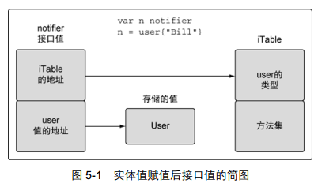
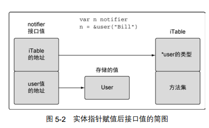

[TOC]


#第 5 章 Go 语言的类型系统 83

Go 语言是一种静态类型的编程语言。这意味着，编译器需要在编译时知晓程序里每个值的 类型  .

值的类型给编译器提供两部分信息：

第一部分，需要分配多少内存给这个值（即值的规模）； 

第二部分，这段内存表示什么。

对于许多内置类型的情况来说，规模和表示是类型名的一部分  

##5.1 用户定义的类型 83

Go 语言里声 明用户定义的类型有两种方法。

最常用的方法是使用关键字 struct，它可以让用户创建一个结 构类型。  结构类型通过组合一系列固定且唯一的字段来声明，如代码清单 5-1 所示。   

```go
代码清单 5-1 声明一个结构类型
01 // user 在程序里定义一个用户类型
02 type user struct {
03 name string
04 email string
05 ext int
06 privileged bool
07 }
代码清单 5-2 使用结构类型声明变量，并初始化为其零值
09 // 声明 user 类型的变量
10 var bill user
```

对数值类型来说，零值是 0；对字符串来说，零值是空字符串；对 布尔类型，零值是 false。对这个例子里的结构，结构里每个字段都会用零值初始化。  

任何时候，创建一个变量并初始化为其零值，习惯是使用关键字 var。这种用法是为了更明 确地表示一个变量被设置为零值。如果变量被初始化为某个非零值，就配合结构字面量和短变量 声明操作符来创建变量。  

```go
代码清单 5-3 使用结构字面量来声明一个结构类型的变量
12 // 声明 user 类型的变量，并初始化所有字段
13 lisa := user{
14 name: "Lisa",
15 email: "lisa@email.com",
16 ext: 123,
17 privileged: true,
18 }

代码清单 5-4 使用结构字面量创建结构类型的值
13 user{
14 name: "Lisa",
15 email: "lisa@email.com",
16 ext: 123,
17 privileged: true,
18 }
```

结构字面量可以对结构类型采用两种形式。代码清单 5-4 中使用了第一种形式，这种形式在
不同行声明每个字段的名字以及对应的值。字段名与值用冒号分隔，每一行以逗号结尾。这种形
式对字段的声明顺序没有要求。第二种形式没有字段名，只声明对应的值，如代码清单 5-5 所示

```
代码清单 5-5 不使用字段名，创建结构类型的值
12 // 声明 user 类型的变量
13 lisa := user{"Lisa", "lisa@email.com", 123, true}
```

每个值也可以分别占一行，不过习惯上这种形式会写在一行里，结尾不需要逗号。这种形式 下，值的顺序很重要，必须要和结构声明中字段的顺序一致。当声明结构类型时，字段的类型并 不限制在内置类型，也可以使用其他用户定义的类型，如代码清单 5-6 所示。  


#### 代码清单 5-9 给不同类型的变量赋值会产生编译错误

```
代码清单 5-9 给不同类型的变量赋值会产生编译错误
01 package main
02
03 type Duration int64
04
05 func main() {
06 var dur Duration
07 dur = int64(1000)
08 }

```

代码清单 5-9 所示的程序在第 03 行声明了 Duration 类型。之后在第 06 行声明了一个类型
为 Duration 的变量 dur，并使用零值作为初值。之后，第 7 行的代码会在编译的时候产生编
译错误，如代码清单 5-10 所示。
代码清单 5-10 实际产生的编译错误
prog.go:7: cannot use int64(1000) (type int64) as type Duration
in assignment
编译器很清楚这个程序的问题：类型 int64 的值不能作为类型 Duration 的值来用。换句
话说，虽然 int64 类型是基础类型， Duration 类型依然是一个独立的类型。两种不同类型的
值即便互相兼容，也不能互相赋值。编译器不会对不同类型的值做隐式转换。


##5.2 方法 87

方法能给用户定义的类型添加新的行为。

方法实际上也是函数，只是在声明时，在关键字 func 和方法名之间增加了一个参数.

关键字 func 和函数名之间的 参数被称作接收者，将函数与接收者的类型绑在一起。如果一个函数有接收者，这个函数就被称 为方法。

Go 语言既允许使用值，也允许使用指针来调用方法，不必严格符合接收者的类型  

```go
/ Sample program to show how to declare methods and how the Go
// compiler supports them.
package main

import (
	"fmt"
)

// user defines a user in the program.
type user struct {
	name  string
	email string
}

// notify implements a method with a value receiver.
func (u user) notify() {
	fmt.Printf("Sending User Email To %s<%s>\n",
		u.name,
		u.email)
}

// changeEmail implements a method with a pointer receiver.
func (u *user) changeEmail(email string) {
	u.email = email
}

// main is the entry point for the application.
func main() {
	// Values of type user can be used to call methods
	// declared with a value receiver.
	bill := user{"Bill", "bill@email.com"}
	bill.notify()

	// Pointers of type user can also be used to call methods
	// declared with a value receiver.
	lisa := &user{"Lisa", "lisa@email.com"}
	lisa.notify()

	// Values of type user can be used to call methods
	// declared with a pointer receiver.
	bill.changeEmail("bill@newdomain.com")
	bill.notify()

	// Pointers of type user can be used to call methods
	// declared with a pointer receiver.
	lisa.changeEmail("lisa@newdomain.com")
	lisa.notify()
}

fanshuang@fanshuang-d1 MINGW64 /d/github.fanshuang/goBookSrc/src/github.com/goinaction/code/chapter5/listing11 (master)
$ go run listing11.go
Sending User Email To Bill<bill@email.com>
Sending User Email To Lisa<lisa@email.com>
Sending User Email To Bill<bill@newdomain.com>
Sending User Email To Lisa<lisa@newdomain.com>

```


Go 语言里有两种类型的接收者： **值接收者和指针接收者。**  

```go
代码清单 5-16 使用变量来调用方法
bill.notify()
```

	这个语法与调用一个包里的函数看起来很类似。但在这个例子里， bill 不是包名，而是变 量名。这段程序在调用 notify 方法时，使用 bill 的值作为接收者进行调用，方法 notify 会接收到 bill 的值的一个副本。  

也可以使用指针来调用使用值接收者声明的方法，如代码清单 5-17 所示。

```go
代码清单 5-17 listing11.go：第 34 行到第 37 行
34 // 指向 user 类型值的指针也可以用来调用
35 // 使用值接收者声明的方法
36 lisa := &user{"Lisa", "lisa@email.com"}
37 lisa.notify()
代码清单 5-17 展示了如何使用指向 user 类型值的指针来调用 notify 方法。在第 36 行，
声明了一个名为 lisa 的指针变量，并使用给定的名字和电子邮件地址做初始化。之后在第 37
行，使用这个指针变量来调用 notify 方法。为了支持这种方法调用， Go 语言调整了指针的值，
来符合方法接收者的定义。可以认为 Go 语言执行了代码清单 5-18 所示的操作。

代码清单 5-18 Go 在代码背后的执行动作
(*lisa).notify()
```

	代码清单 5-18 展示了 Go 编译器为了支持这种方法调用背后做的事情。指针被解引用为值， 这样就符合了值接收者的要求。**再强调一次， notify 操作的是一个副本**，只不过这次操作的是 从 lisa 指针指向的值的副本。  

总结一下，值接收者使用 值的副本来调用方法，而指针接受者使用实际值来调用方法。  

##5.3 类型的本质 90

在声明一个新类型之后，声明一个该类型的方法之前，需要先回答一个问题：这个类型的本 质是什么。如果给这个类型增加或者删除某个值，是要创建一个新值，还是要更改当前的值？

如果是要创建一个新值，该类型的方法就使用值接收者。

如果是要修改当前值，就使用指针接收者  

这个背后的原则是，不要只关注某个方法是如何处理这个值，而是**要关注 这个值的本质是什么**。  

###5.3.1 内置类型 91

	内置类型是由语言提供的一组类型。我们已经见过这些类型，分别是数值类型、字符串string  类型 和布尔类型。这些类型本质上是原始的类型。因此，当对这些值进行增加或者删除的时候，会创 建一个新值。  
	
	基于这个结论，当把这些类型的值传递给方法或者函数时，应该传递一个对应值的 副本。  


###5.3.2 引用类型 91

	Go 语言里的引用类型有如下几个：切片、映射、通道、接口和函数类型  。当声明上述类型  的变量时，创建的变量被称作**标头（header）值**。  从技术细节上说，字符串也是一种引用类型。 每个引用类型创建的标头值是包含一个指向底层数据结构的指针。 
	
	 每个引用类型还包含一组独特 的字段，用于管理底层数据结构。因为**标头值是为复制而设计**的，所以永远不需要共享一个引用 类型的值。标头值里包含一个指针，因此通过复制来传递一个引用类型的值的副本，本质上就是 在共享底层数据结构。  


###5.3.3 结构类型 93

	  结构类型可以用来描述一组数据值，这组值的本质即可以是原始的，也可以是非原始的。如 果决定在某些东西需要删除或者添加某个结构类型的值时该结构类型的值不应该被更改，那么需 要遵守之前提到的内置类型和引用类型的规范。  

即便函数或者方法没有直接改变非原始的值的状态，依旧应该使用共享的方式传递，  如代码 清单 5-33 所示。  

```go
代码清单 5-33 golang.org/src/os/file.go：第 224 行到第 232 行
224 func (f *File) Chdir() error {
225 if f == nil {
226 return ErrInvalid
227 }
228 if e := syscall.Fchdir(f.fd); e != nil {
229 return &PathError{"chdir", f.name, e}
230 }
231 return nil
232 }
```

	代码清单 5-33 中的 Chdir 方法展示了，即使没有修改接收者的值，依然是用指针接收者来 声明的。**因为 File 类型的值具备非原始的本质，所以总是应该被共享**，而不是被复制。  
	
	**程序员需要能识别出每个类型的本质，并使用这个本质来 决定如何组织类型。**


	是使用值接收者还是指针接收者，不应该由该方法是否修改了接收到的值来决定。这个决策 应该基于该类型的本质。
	
	这条规则的一个例外是，需要让类型值符合某个接口的时候，即便类型 的本质是非原始本质的，也可以选择使用值接收者声明方法。这样做完全符合接口值调用方法的 机制。 5.4 节会讲解什么是接口值，以及使用接口值调用方法的机制。  


##5.4 接口 95

	多态是指代码可以根据类型的具体实现采取不同行为的能力。如果一个类型实现了某个接 口，所有使用这个接口的地方，都可以支持这种类型的值。标准库里有很好的例子，如 io 包里 实现的流式处理接口。 io 包提供了一组构造得非常好的接口和函数，来让代码轻松支持流式数 据处理。只要实现两个接口，就能利用整个 io 包背后的所有强大能力。  

###5.4.1 标准库 96


###5.4.2 实现 98

	接口是用来定义行为的类型。这 些被定义的行为不由接口直接实现，而是通过方法由用户 定义的类型实现。  
	
	探寻方法集的细节之前，了解接口类型值 大概的形式以及用户定义的类型的值是如何存入接口的，会有很多帮助。  
	
	图 5-1 展示了在 user 类型值赋值后接口变量的值的内部布局。接口值是一个两个字长度 的数据结构，
	
	第一个字包含一个指向内部表的指针。这个内部表叫作 iTable，包含了所存储的 值的类型信息。 iTable 包含了已存储的值的类型信息以及与这个值相关联的一组方法。
	
	第二个 字是一个指向所存储值的指针。将类型信息和指针组合在一起，就将这两个值组成了一种特殊 的关系。  



	图 5-2 展示了一个指针赋值给接口之后发生的变化。在这种情况里，类型信息会存储一个指 向保存的类型的指针，而接口值第二个字依旧保存指向实体值的指针。  
	
	


###5.4.3 方法集 99

	方法集定义了一组关联到给定类型的值或者指针的方法。定义方法时使用的接收者的类型决 定了这个方法是关联到值，还是关联到指针，还是两个都关联。  

代码清单 5-42 规范里描述的方法集 

Values Methods Receivers 

-----------------------------------------------

T (t T) 

*T (t T) and (t *T)  

	代码清单 5-42 展示了规范里对方法集的描述。描述中说到， T 类型的值的方法集只包含值 接收者声明的方法。而指向 T 类型的指针的方法集既包含值接收者声明的方法，也包含指针接收 者声明的方法。  
	
	从值的角度看这些规则，会显得很复杂。让我们从接收者的角度来看一下这些规 则，如代码清单 5-43 所示。  

```
代码清单 5-43 从接收者类型的角度来看方法集
Methods Receivers Values
-----------------------------------------------
(t T) T and *T
(t *T) *T
```

	代码清单 5-43 展示了同样的规则，只不过换成了接收者的视角。
	
	这个规则说，如果使用指 针接收者来实现一个接口，那么只有指向那个类型的指针才能够实现对应的接口。如果使用值 接收者来实现一个接口，那么那个类型的值和指针都能够实现对应的接口。  
	
	现在的问题是，为什么会有这种限制？事实上，编译器并不是总能自动获得一个值的地址 如代码清单 5-46 所示。  

```go
代码清单 5-46 listing46.go
01 // 这个示例程序展示不是总能
02 // 获取值的地址03 package main
04
05 import "fmt"
06
07 // duration 是一个基于 int 类型的类型
08 type duration int
09
10 // 使用更可读的方式格式化 duration 值
11 func (d *duration) pretty() string {
12 return fmt.Sprintf("Duration: %d", *d)
13 }
14
15 // main 是应用程序的入口
16 func main() {
17 duration(42).pretty()
18
19 // ./listing46.go:17: 不能通过指针调用 duration(42)的方法
20 // ./listing46.go:17: 不能获取 duration(42)的地址
21 }
```

代码清单 5-46 所示的代码试图获取 duration 类型的值的地址，但是获取不到。

```
代码清单 5-47 再看一下方法集的规则
Values Methods Receivers
-----------------------------------------------
T (t T)
*T (t T) and (t *T)
Methods Receivers Values
-----------------------------------------------
(t T) T and *T
(t *T) *T
因为不是总能获取一个值的地址，所以值的方法集只包括了使用值接收者实现的方法。
```


###5.4.4 多态 103


##5.5 嵌入类型 105

	Go 语言允许用户扩展或者修改已有类型的行为。这个功能对代码复用很重要，在修改已有
类型以符合新类型的时候也很重要。这个功能是通过嵌入类型（type embedding）完成的。嵌入类
型是将已有的类型直接声明在新的结构类型里。被嵌入的类型被称为新的外部类型的内部类型。

	通过嵌入类型，与内部类型相关的标识符会提升到外部类型上。这些被提升的标识符就像直 接声明在外部类型里的标识符一样，也是外部类型的一部分。这样外部类型就组合了内部类型包 含的所有属性，并且可以添加新的字段和方法。
	
	外部类型也可以通过**声明与内部类型标识符同名 的标识符**来覆盖内部标识符的字段或者方法。这就是扩展或者修改已有类型的方法。  


##5.6 公开或未公开的标识符 113

	要想设计出好的 API，需要使用某种规则来控制声明后的标识符的可见性。 Go 语言支持从 包里公开或者隐藏标识符。通过这个功能，让用户能按照自己的规则控制标识符的可见性。在第 3 章讨论包的时候，谈到了如何从一个包引入标识符到另一个包。有时候，你可能不希望公开包 里的某个类型、函数或者方法这样的标识符。在这种情况，需要一种方法，将这些标识符声明为 包外不可见，这时需要将这些标识符声明为未公开的。  
	
	当要 写的代码属于某个包时，好的实践是使用与代码所在文件夹一样的名字作为包名。所有的 Go 工 具都会利用这个习惯，所以最好遵守这个好的实践。  
	
	**当一个标识符的名字以小写字母开头时，这个标识符就是未公开的，即包外的代码不可见。 如果一个标识符以大写字母开头，这个标识符就是公开的，即被包外的代码可见**。  
	
	要让这个行为可行，需要两个理由。第一，公开或者未公开的标识符，不是一个值。第二， 短变量声明操作符，有能力捕获引用的类型，并创建一个未公开的类型的变量。永远不能显式创 建一个未公开的类型的变量，不过短变量声明操作符可以这么做。  

```go
代码清单 5-75 entities/entities.go
01 // entities 包包含系统中
02 // 与人有关的类型
03 package entities
04
05 // user 在程序里定义一个用户类型
06 type user struct {
07 Name string
08 Email string
09 }
10
11 // Admin 在程序里定义了管理员
12 type Admin struct {
13 user // 嵌入的类型未公开
14 Rights int
15 }
代码清单 5-76 listing74.go：第 11 到 24 行
11 // main 是应用程序的入口
12 func main() {
13 // 创建 entities 包中的 Admin 类型的值
14 a := entities.Admin{
15 Rights: 10,
16 }
17
18 // 设置未公开的内部类型的
19 // 公开字段的值
20 a.Name = "Bill"
21 a.Email = "bill@email.com"
22
23 fmt.Printf("User: %v\n", a)
24 }
```

	让我们从代码清单 5-76 的第 14 行的 main 函数开始。这个函数创建了 entities 包中的 dmin 类型的值。由于内部类型 user 是未公开的，这段代码**无法直接通过结构字面量的方式初 始化该内部类型**。		
	
	不过，即便内部类型是未公开的，内部类型里声明的字段依旧是公开的。既然 内部类型的标识符提升到了外部类型，这些公开的字段也可以通过外部类型的字段的值来访问。
	
	 因此，在第 20 行和第 21 行，来自**未公开的内部类型的字段 Name 和 Email 可以通过外部 类型的变量 a 被访问并被初始化**。因为 user 类型是未公开的，所以这里没有直接访问内部类型。  


##5.7 小结 121

使用关键字 struct 或者通过指定已经存在的类型，可以声明用户定义的类型。 

方法提供了一种给用户定义的类型增加行为的方式。 

设计类型时需要确认类型的本质是原始的，还是非原始的。 

接口是声明了一组行为并支持多态的类型。 

嵌入类型提供了扩展类型的能力，而无需使用继承。

标识符要么是从包里公开的，要么是在包里未公开的。  