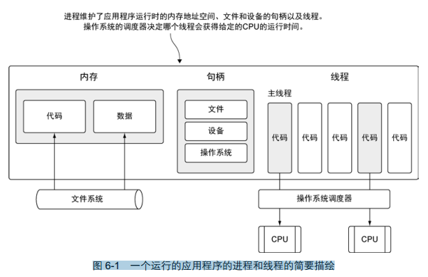
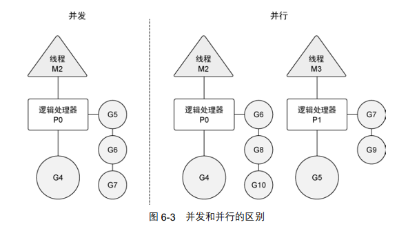
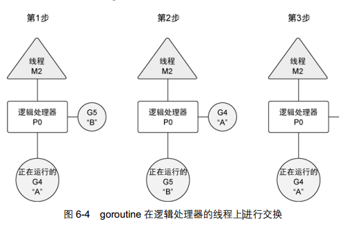

#第 6 章 并发 122 

	每个套接字请求都是独立的，可以完全独立于其他套接字进行处理。具 有并行执行多个请求的能力可以显著提高这类系统的性能。  考虑到这一点， Go 语言的语法和运 行时直接内置了对并发的支持  。

	Go 语言里的并发指的是能让某个函数独立于其他函数运行的能力。当一个函数创建为 goroutine 时， Go 会将其视为一个独立的工作单元。这个单元会被调度到可用的逻辑处理器上执行。 Go 语言 运行时的调度器是一个复杂的软件，能管理被创建的所有 goroutine 并为其分配执行时间。这个调度 器在操作系统之上，将操作系统的线程与语言运行时的逻辑处理器绑定，并在逻辑处理器上运行 goroutine。调度器在任何给定的时间，都会全面控制哪个 goroutine 要在哪个逻辑处理器上运行  。

	Go 语言的并发同步模型来自一个叫作通信顺序进程（Communicating Sequential Processes， CSP） 的范型（paradigm）。 CSP 是一种消息传递模型，通过在 goroutine 之间传递数据来传递消息，而不是 对数据进行加锁来实现同步访问。用于在 goroutine 之间同步和传递数据的关键数据类型叫作通道 （channel）  。

##6.1 并发与并行 122 

	让我们先来学习一下抽象程度较高的概念：什么是操作系统的线程（thread）和进程（process）。

  	图 6-1 展示了一个包含所有可能分配的常用资源的进程。这些资源包括但不限于内存地址空 间、文件和设备的句柄以及线程。一个线程是一个执行空间，这个空间会被操作系统调度来运行 函数中所写的代码。每个进程至少包含一个线程，每个进程的初始线程被称作主线程。因为执行 这个线程的空间是应用程序的本身的空间，所以当主线程终止时，应用程序也会终止。操作系统 将线程调度到某个处理器上运行，这个处理器并不一定是进程所在的处理器。不同操作系统使用 的线程调度算法一般都不一样，但是这种不同会被操作系统屏蔽，并不会展示给程序员。  

	操作系统会在物理处理器上调度线程来运行，而 Go 语言的运行时会在逻辑处理器上调度 goroutine来运行。每个逻辑处理器都分别绑定到单个操作系统线程。  

	在 1.5 版本 ① 在图 6-2 中，可以看到操作系统线程、逻辑处理器和本地运行队列之间的关系。如果创建一 个 goroutine 并准备运行，这个 goroutine 就会被放到调度器的全局运行队列中。之后，调度器就 将这些队列中的 goroutine 分配给一个逻辑处理器，并放到这个逻辑处理器对应的本地运行队列 上， Go语言的 运行时默认会为每个可用的物理处理器分配一个逻辑处理器。在 1.5 版本之前的版本中， 默认给 整个应用程序只分配一个逻辑处理器。这些逻辑处理器会用于执行所有被创建的goroutine。即便 只有一个逻辑处理器， Go也可以以神奇的效率和性能，并发调度无数个goroutine。  

	在图 6-2 中，可以看到操作系统线程、逻辑处理器和本地运行队列之间的关系。如果创建一 个 goroutine 并准备运行，这个 goroutine 就会被放到调度器的全局运行队列中。之后，调度器就 将这些队列中的 goroutine 分配给一个逻辑处理器，并放到这个逻辑处理器对应的本地运行队列  中。本地运行队列中的 goroutine 会一直等待直到自己被分配的逻辑处理器执行。  

	有时， 正在运行的 goroutine 需要执行一个阻塞的系统调用，如打开一个文件。当这类调用 发生时，线程和 goroutine 会从逻辑处理器上分离，该线程会继续阻塞，等待系统调用的返回。 与此同时，这个逻辑处理器就失去了用来运行的线程。所以，调度器会创建一个新线程，并将其 绑定到该逻辑处理器上。之后，调度器会从本地运行队列里选择另一个 goroutine 来运行。一旦 被阻塞的系统调用执行完成并返回，对应的 goroutine 会放回到本地运行队列，而之前的线程会 保存好，以便之后可以继续使用  

	如果一个 goroutine 需要做一个网络 I/O 调用，流程上会有些不一样。在这种情况下，goroutine 会和逻辑处理器分离，并移到集成了网络轮询器的运行时。一旦该轮询器指示某个网络读或者写 操作已经就绪，对应的 goroutine 就会重新分配到逻辑处理器上来完成操作。调度器对可以创建 的逻辑处理器的数量没有限制，但语言运行时默认限制每个程序最多创建 10 000 个线程。这个 限制值可以通过调用 runtime/debug 包的 SetMaxThreads 方法来更改。如果程序试图使用 更多的线程，就会崩溃  

	并发（concurrency）不是并行（parallelism）。并行是让不同的代码片段同时在不同的物理处 理器上执行。**并行的关键是同时做很多事情，而并发是指同时管理很多事情，这些事情可能只做 了一半就被暂停去做别的事情了**。在很多情况下，并发的效果比并行好，因为操作系统和硬件的 总资源一般很少，但能支持系统同时做很多事情。这种“**使用较少的资源做更多的事情**” 的哲学， 也是指导 Go 语言设计的哲学。  

	如果希望让 goroutine 并行，必须使用多于一个逻辑处理器。 当有多个逻辑处理器时，调度器会将 goroutine 平等分配到每个逻辑处理器上。这会让 goroutine 在不同的线程上运行。不过要想真 的实现并行的效果，用户需要让自己的程序运行在有多个物理处理器的机器上。否则，哪怕 Go 语 言运行时使用多个线程， goroutine 依然会在同一个物理处理器上并发运行，达不到并行的效果。    

	图 6-3展示了在一个逻辑处理器上并发运行 goroutine和在两个逻辑处理器上并行运行两个并 发的 goroutine 之间的区别。调度器包含一些聪明的算法，这些算法会随着 Go 语言的发布被更新 和改进，所以不推荐盲目修改语言运行时对逻辑处理器的默认设置。如果真的认为修改逻辑处理 器的数量可以改进性能，也可以对语言运行时的参数进行细微调整。后面会介绍如何做这种修改。  

##6.2 goroutine 125

	让我们再深入了解一下调度器的行为，以及调度器是如何创建 goroutine 并管理其寿命的。 我们会先通过在一个逻辑处理器上运行的例子来讲解，再来讨论如何让 goroutine 并行运行。代 码清单 6-1 所示的程序会创建两个 goroutine，以并发的形式分别显示大写和小写的英文字母。  

	基于调度器的内部算法，一个正运行的 goroutine 在工作结束前，可以被停止并重新调度。  调度器这样做的目的是防止某个 goroutine 长时间占用逻辑处理器。当 goroutine 占用时间过长时， 调度器会停止当前正运行的 goroutine，并给其他可运行的 goroutine 运行的机会。  

	图 6-4 从逻辑处理器的角度展示了这一场景。在第 1 步，调度器开始运行 goroutine A，而 goroutine B 在运行队列里等待调度。之后，在第 2 步，调度器交换了 goroutine A 和 goroutine B。 由于 goroutine A 并没有完成工作，因此被放回到运行队列。之后，在第 3 步， goroutine B 完成 了它的工作并被系统销毁。这也让 goroutine A 继续之前的工作。  

##6.3 竞争状态 132

##6.4 锁住共享资源 135 

###6.4.1 原子函数 135 

###6.4.2 互斥锁 138 

##6.5 通道 140 

###6.5.1 无缓冲的通道 141 

###6.5.2 有缓冲的通道 146 

##6.6 小结 149  