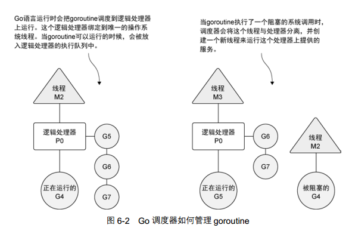

#第 6 章 并发 122 

	每个套接字请求都是独立的，可以完全独立于其他套接字进行处理。具 有并行执行多个请求的能力可以显著提高这类系统的性能。  考虑到这一点， Go 语言的语法和运 行时直接内置了对并发的支持  。
	
	Go 语言里的并发指的是能让某个函数独立于其他函数运行的能力。当一个函数创建为 goroutine 时， Go 会将其视为一个独立的工作单元。这个单元会被调度到可用的逻辑处理器上执行。 Go 语言 运行时的调度器是一个复杂的软件，能管理被创建的所有 goroutine 并为其分配执行时间。这个调度 器在操作系统之上，将操作系统的线程与语言运行时的逻辑处理器绑定，并在逻辑处理器上运行 goroutine。调度器在任何给定的时间，都会全面控制哪个 goroutine 要在哪个逻辑处理器上运行  。
	
	Go 语言的并发同步模型来自一个叫作通信顺序进程（Communicating Sequential Processes， CSP） 的范型（paradigm）。 CSP 是一种消息传递模型，通过在 goroutine 之间传递数据来传递消息，而不是 对数据进行加锁来实现同步访问。用于在 goroutine 之间同步和传递数据的关键数据类型叫作通道 （channel）  。

##6.1 并发与并行 122 

	让我们先来学习一下抽象程度较高的概念：什么是操作系统的线程（thread）和进程（process）。

  	图 6-1 展示了一个包含所有可能分配的常用资源的进程。这些资源包括但不限于内存地址空 间、文件和设备的句柄以及线程。一个线程是一个执行空间，这个空间会被操作系统调度来运行 函数中所写的代码。每个进程至少包含一个线程，每个进程的初始线程被称作主线程。因为执行 这个线程的空间是应用程序的本身的空间，所以当主线程终止时，应用程序也会终止。操作系统 将线程调度到某个处理器上运行，这个处理器并不一定是进程所在的处理器。不同操作系统使用 的线程调度算法一般都不一样，但是这种不同会被操作系统屏蔽，并不会展示给程序员。  


	操作系统会在物理处理器上调度线程来运行，而 Go 语言的运行时会在逻辑处理器上调度 goroutine来运行。每个逻辑处理器都分别绑定到单个操作系统线程。  
	
	在 1.5 版本 ① 在图 6-2 中，可以看到操作系统线程、逻辑处理器和本地运行队列之间的关系。如果创建一 个 goroutine 并准备运行，这个 goroutine 就会被放到调度器的全局运行队列中。之后，调度器就 将这些队列中的 goroutine 分配给一个逻辑处理器，并放到这个逻辑处理器对应的本地运行队列 上， Go语言的 运行时默认会为每个可用的物理处理器分配一个逻辑处理器。在 1.5 版本之前的版本中， 默认给 整个应用程序只分配一个逻辑处理器。这些逻辑处理器会用于执行所有被创建的goroutine。即便 只有一个逻辑处理器， Go也可以以神奇的效率和性能，并发调度无数个goroutine。  
	
	在图 6-2 中，可以看到操作系统线程、逻辑处理器和本地运行队列之间的关系。如果创建一 个 goroutine 并准备运行，这个 goroutine 就会被放到调度器的全局运行队列中。之后，调度器就 将这些队列中的 goroutine 分配给一个逻辑处理器，并放到这个逻辑处理器对应的本地运行队列  中。本地运行队列中的 goroutine 会一直等待直到自己被分配的逻辑处理器执行。  



	有时， 正在运行的 goroutine 需要执行一个阻塞的系统调用，如打开一个文件。当这类调用 发生时，线程和 goroutine 会从逻辑处理器上分离，该线程会继续阻塞，等待系统调用的返回。 与此同时，这个逻辑处理器就失去了用来运行的线程。所以，调度器会创建一个新线程，并将其 绑定到该逻辑处理器上。之后，调度器会从本地运行队列里选择另一个 goroutine 来运行。一旦 被阻塞的系统调用执行完成并返回，对应的 goroutine 会放回到本地运行队列，而之前的线程会 保存好，以便之后可以继续使用  
	
	如果一个 goroutine 需要做一个网络 I/O 调用，流程上会有些不一样。在这种情况下，goroutine 会和逻辑处理器分离，并移到集成了网络轮询器的运行时。一旦该轮询器指示某个网络读或者写 操作已经就绪，对应的 goroutine 就会重新分配到逻辑处理器上来完成操作。调度器对可以创建 的逻辑处理器的数量没有限制，但语言运行时默认限制每个程序最多创建 10 000 个线程。这个 限制值可以通过调用 runtime/debug 包的 SetMaxThreads 方法来更改。如果程序试图使用 更多的线程，就会崩溃  
	
	并发（concurrency）不是并行（parallelism）。并行是让不同的代码片段同时在不同的物理处 理器上执行。**并行的关键是同时做很多事情，而并发是指同时管理很多事情，这些事情可能只做 了一半就被暂停去做别的事情了**。在很多情况下，并发的效果比并行好，因为操作系统和硬件的 总资源一般很少，但能支持系统同时做很多事情。这种“**使用较少的资源做更多的事情**” 的哲学， 也是指导 Go 语言设计的哲学。  
	
	如果希望让 goroutine 并行，必须使用多于一个逻辑处理器。 当有多个逻辑处理器时，调度器会将 goroutine 平等分配到每个逻辑处理器上。这会让 goroutine 在不同的线程上运行。不过要想真 的实现并行的效果，用户需要让自己的程序运行在有多个物理处理器的机器上。否则，哪怕 Go 语 言运行时使用多个线程， goroutine 依然会在同一个物理处理器上并发运行，达不到并行的效果。    
	
	图 6-3展示了在一个逻辑处理器上并发运行 goroutine和在两个逻辑处理器上并行运行两个并 发的 goroutine 之间的区别。调度器包含一些聪明的算法，这些算法会随着 Go 语言的发布被更新 和改进，所以不推荐盲目修改语言运行时对逻辑处理器的默认设置。如果真的认为修改逻辑处理 器的数量可以改进性能，也可以对语言运行时的参数进行细微调整。后面会介绍如何做这种修改。  


##6.2 goroutine 125

	让我们再深入了解一下调度器的行为，以及调度器是如何创建 goroutine 并管理其寿命的。 我们会先通过在一个逻辑处理器上运行的例子来讲解，再来讨论如何让 goroutine 并行运行。代 码清单 6-1 所示的程序会创建两个 goroutine，以并发的形式分别显示大写和小写的英文字母。  
	
	基于调度器的内部算法，一个正运行的 goroutine 在工作结束前，可以被停止并重新调度。  调度器这样做的目的是防止某个 goroutine 长时间占用逻辑处理器。当 goroutine 占用时间过长时， 调度器会停止当前正运行的 goroutine，并给其他可运行的 goroutine 运行的机会。  
	
	图 6-4 从逻辑处理器的角度展示了这一场景。在第 1 步，调度器开始运行 goroutine A，而 goroutine B 在运行队列里等待调度。之后，在第 2 步，调度器交换了 goroutine A 和 goroutine B。 由于 goroutine A 并没有完成工作，因此被放回到运行队列。之后，在第 3 步， goroutine B 完成 了它的工作并被系统销毁。这也让 goroutine A 继续之前的工作。  


##6.3 竞争状态 132

	如果两个或者多个 goroutine 在没有互相同步的情况下，访问某个共享的资源，并试图同时 读和写这个资源，就处于相互竞争的状态，这种情况被称作竞争状态（race candition）。

	  竞争状态 的存在是让并发程序变得复杂的地方，十分容易引起潜在问题。**对一个共享资源的读和写操作必 须是原子化的**，换句话说，**同一时刻只能有一个 goroutine 对共享资源进行读和写操作**。代码清 单 6-9 中给出的是包含竞争状态的示例程序。  

	Go 语言有一个特别的工具，可以在代码里检测竞争状态。在查找这类错误的时候，这个工 具非常好用，尤其是在竞争状态并不像这个例子里这么明显的时候。让我们用这个竞争检测器来 检测一下我们的例子代码，如代码清单 6-11 所示。  

代码清单 6-11 用竞争检测器来编译并执行 listing09 的代码 go build -race // 用竞争检测器标志来编译程序  

	代码清单 6-12 展示了竞争检测器查到的哪个 goroutine 引发了数据竞争，以及哪两行代码有
冲突。毫不奇怪，这几行代码分别是对 counter 变量的读和写操作。
	一种修正代码、消除竞争状态的办法是，使用 Go 语言提供的锁机制，来锁住共享资源，从
而保证 goroutine 的同步状态。

##6.4 锁住共享资源 135 

	Go 语言提供了传统的同步 goroutine 的机制，就是对共享资源加锁。如果需要顺序访问一个 整型变量或者一段代码， atomic 和 sync 包里的函数提供了很好的解决方案。下面我们了解一 下 atomic 包里的几个函数以及 sync 包里的 mutex 类型。  

###6.4.1 原子函数 135 

	原子函数能够以很底层的加锁机制来同步访问整型变量和指针。  

###6.4.2 互斥锁 138 


##6.5 通道 140 

	在 Go 语言里，你不仅可以使用原子函数和互斥锁来保证对共享资源的安全访 问以及消除竞争状态，还可以使用通道，通过发送和接收需要共享的资源，在 goroutine 之间做 同步。  

	 当一个资源需要在 goroutine 之间共享时，通道在 goroutine 之间架起了一个管道，并提供了 确保同步交换数据的机制。声明通道时，需要指定将要被共享的数据的类型。可以通过通道共享 内置类型、命名类型、结构类型和引用类型的值或者指针。 在 Go 语言中需要使用内置函数 make 来创建一个通道，如代码清单 6-17 所示  

```go
代码清单 6-17 使用 make 创建通道
// 无缓冲的整型通道
unbuffered := make(chan int)
// 有缓冲的字符串通道
buffered := make(chan string, 10)

```


```go
代码清单 6-19 从通道里接收值
// 从通道接收一个字符串
value := <-buffered
```

		当从通道里接收一个值或者指针时， <-运算符在要操作的通道变量的左侧，如代码清单 6-19 所示。 通道是否带有缓冲，其行为会有一些不同。理解这个差异对决定到底应该使用还是不使用缓 冲很有帮助。下面我们分别介绍一下这两种类型。  

	

###6.5.1 无缓冲的通道 141 

	无缓冲的通道（unbuffered channel）是指在接收前没有能力保存任何值的通道。这种类型的通 道要求发送 goroutine 和接收 goroutine 同时准备好，才能完成发送和接收操作。

	如果两个 goroutine 没有同时准备好，通道会导致先执行发送或接收操作的 goroutine 阻塞等待。这种对通道进行发送 和接收的交互行为本身就是同步的。其中任意一个操作都无法离开另一个操作单独存在。  

	在图 6-6 里，可以看到一个例子，展示两个 goroutine 如何利用无缓冲的通道来共享一个值  

	

	第1 步，两个 goroutine 都到达通道，但哪个都没有开始执行发送或者接收。在第 2 步，左侧 的 goroutine 将它的手伸进了通道，这模拟了向通道发送数据的行为。这时，这个 goroutine 会在 通道中被锁住，直到交换完成。在第 3 步，右侧的 goroutine 将它的手放入通道，这模拟了从通 道里接收数据。这个 goroutine 一样也会在通道中被锁住，直到交换完成。在第 4 步和第 5 步， 进行交换，并最终，在第 6 步，两个 goroutine 都将它们的手从通道里拿出来，这模拟了被锁住 的 goroutine 得到释放。两个 goroutine 现在都可以去做别的事情了。  

	为了讲得更清楚，让我们来看两个完整的例子。这两个例子都会使用无缓冲的通道在两个 goroutine 之间同步交换数据。 

	在网球比赛中，两位选手会把球在两个人之间来回传递。选手总是处在以下两种状态之一： 要么在等待接球，要么将球打向对方。可以使用两个 goroutine 来模拟网球比赛，并使用无缓冲 的通道来模拟球的来回，如代码清单 6-20 所示。  

```go
代码清单 6-20 listing20.go
01 // 这个示例程序展示如何用无缓冲的通道来模拟
02 // 2 个 goroutine 间的网球比赛
03 package main
04
05 import (
06 "fmt"
07 "math/rand"
08 "sync"
09 "time"
10 )
11
12 // wg 用来等待程序结束
13 var wg sync.WaitGroup
14
15 func init() {
16 rand.Seed(time.Now().UnixNano())
17 }
18
19 // main 是所有 Go 程序的入口
20 func main() {
21 // 创建一个无缓冲的通道
22 court := make(chan int)
23
24 // 计数加 2，表示要等待两个 goroutine
25 wg.Add(2)
26
27 // 启动两个选手
28 go player("Nadal", court)
29 go player("Djokovic", court)
30
31 // 发球
32 court <- 1
33
34 // 等待游戏结束35 wg.Wait()
36 }
37
38 // player 模拟一个选手在打网球
39 func player(name string, court chan int) {
40 // 在函数退出时调用 Done 来通知 main 函数工作已经完成
41 defer wg.Done()
42
43 for {
44 // 等待球被击打过来
45 ball, ok := <-court
46 if !ok {
47 // 如果通道被关闭，我们就赢了
48 fmt.Printf("Player %s Won\n", name)
49 return
50 }
51
52 // 选随机数，然后用这个数来判断我们是否丢球
53 n := rand.Intn(100)
54 if n%13 == 0 {
55 fmt.Printf("Player %s Missed\n", name)
56
57 // 关闭通道，表示我们输了
58 close(court)
59 return
60 }
61
62 // 显示击球数，并将击球数加 1
63 fmt.Printf("Player %s Hit %d\n", name, ball)
64 ball++
65
66 // 将球打向对手
67 court <- ball
68 }
69 }
运行这个程序会得到代码清单 6-21 所示的输出。
代码清单 6-21 listing20.go 的输出
Player Nadal Hit 1
Player Djokovic Hit 2
Player Nadal Hit 3
Player Djokovic Missed
Player Nadal Won
```

在 main 函数的第 22 行，创建了一个 int 类型的无缓冲的通道，让两个 goroutine 在击球时 能够互相同步。之后在第 28 行和第 29 行，创建了参与比赛的两个 goroutine。

	在这个时候，两个 goroutine 都阻塞住等待击球。

	在第 32 行，将球发到通道里，程序开始执行这个比赛，直到某个 goroutine 输掉比赛。

	 在 player 函数里，在第 43 行可以找到一个无限循环的 for 语句。在这个循环里，是玩游 戏的过程。在第 45 行， goroutine 从通道接收数据，用来表示等待接球。这个接收动作会锁住  goroutine，直到有数据发送到通道里。通道的接收动作返回时，第 46 行会检测 ok 标志是否为 false。如果这个值是 false，表示通道已经被关闭，游戏结束。在第 53 行到第 60 行，会产 生一个随机数，用来决定 goroutine 是否击中了球。如果击中了球，在第 64 行 ball 的值会递增 1，并在第 67 行，将 ball 作为球重新放入通道，发送给另一位选手。在这个时刻，两个 goroutine 都会被锁住，直到交换完成。

	最终，某个 goroutine 没有打中球，在第 58 行关闭通道。之后两个 goroutine 都会返回，通过 defer 声明的 Done 会被执行，程序终止。  


```go
/ This sample program demonstrates how to use an unbuffered
// channel to simulate a relay race between four goroutines.
package main

import (
	"fmt"
	"sync"
	"time"
)

// wg is used to wait for the program to finish.
var wg sync.WaitGroup

// main is the entry point for all Go programs.
func main() {
	// Create an unbuffered channel.
	baton := make(chan int)

	// Add a count of one for the last runner.
	wg.Add(1)

	// First runner to his mark.
	go Runner(baton)

	// Start the race.
	baton <- 1

	// Wait for the race to finish.
	wg.Wait()
}

// Runner simulates a person running in the relay race.
func Runner(baton chan int) {
	var newRunner int

	// Wait to receive the baton.
	runner := <-baton

	// Start running around the track.
	fmt.Printf("Runner %d Running With Baton\n", runner)

	// New runner to the line.
	if runner != 4 {
		newRunner = runner + 1

		go Runner(baton)
	}

	// Running around the track.
	time.Sleep(100 * time.Millisecond)

	// Is the race over.
	if runner == 4 {
		fmt.Printf("Runner %d Finished, Race Over\n", runner)
		wg.Done()
		return
	}

	// Exchange the baton for the next runner.
	fmt.Printf("Runner %d Exchange With Runner %d\n",
		runner,
		newRunner)

	baton <- newRunner
}
```

```
$ go run listing22.go
Runner 1 Running With Baton
Runner 1 Exchange With Runner 2
Runner 2 Running With Baton
Runner 2 Exchange With Runner 3
Runner 3 Running With Baton
Runner 3 Exchange With Runner 4
Runner 4 Running With Baton
Runner 4 Finished, Race Over
```


	另一个例子，用不同的模式，使用无缓冲的通道，在 goroutine 之间同步数据，来模拟接力 比赛。在接力比赛里， 4 个跑步者围绕赛道轮流跑（如代码清单 6-22 所示）。第二个、第三个和 第四个跑步者要接到前一位跑步者的接力棒后才能起跑。比赛中最重要的部分是要传递接力棒， 要求同步传递。在同步接力棒的时候，参与接力的两个跑步者必须在同一时刻准备好交接。  

###6.5.2 有缓冲的通道 146 

	有缓冲的通道（buffered channel）是一种在被接收前能存储一个或者多个值的通道。这种类 型的通道并不强制要求 goroutine 之间必须同时完成发送和接收。通道会阻塞发送和接收动作的 条件也会不同。只有在通道中没有要接收的值时，接收动作才会阻塞。只有在通道没有可用缓冲 区容纳被发送的值时，发送动作才会阻塞。这导致有缓冲的通道和无缓冲的通道之间的一个很大 的不同：无缓冲的通道保证进行发送和接收的 goroutine 会在同一时间进行数据交换；有缓冲的 通道没有这种保证。  

	在图 6-7中可以看到两个 goroutine分别向有缓冲的通道里增加一个值和从有缓冲的通道里移 除一个值。在第 1 步，右侧的 goroutine 正在从通道接收一个值。在第 2 步，右侧的这个 goroutine 独立完成了接收值的动作，而左侧的 goroutine 正在发送一个新值到通道里。在第 3 步，左侧的 goroutine 还在向通道发送新值，而右侧的 goroutine 正在从通道接收另外一个值。这个步骤里的 两个操作既不是同步的，也不会互相阻塞。最后，在第 4 步，所有的发送和接收都完成，而通道 里还有几个值，也有一些空间可以存更多的值。  


让我们看一个使用有缓冲的通道的例子，这个例子管理一组 goroutine 来接收并完成工作。 有缓冲的通道提供了一种清晰而直观的方式来实现这个功能，如代码清单 6-24 所示。 代码清单 6-24 listing24.go  

```go
// This sample program demonstrates how to use a buffered
// channel to work on multiple tasks with a predefined number
// of goroutines.
package main

import (
	"fmt"
	"math/rand"
	"sync"
	"time"
)

const (
	numberGoroutines = 4  // Number of goroutines to use.
	taskLoad         = 10 // Amount of work to process.
)

// wg is used to wait for the program to finish.
var wg sync.WaitGroup

// init is called to initialize the package by the
// Go runtime prior to any other code being executed.
func init() {
	// Seed the random number generator.
	rand.Seed(time.Now().Unix())
}

// main is the entry point for all Go programs.
func main() {
	// Create a buffered channel to manage the task load.
	tasks := make(chan string, taskLoad)

	// Launch goroutines to handle the work.
	wg.Add(numberGoroutines)
	for gr := 1; gr <= numberGoroutines; gr++ {
		go worker(tasks, gr)
	}

	// Add a bunch of work to get done.
	for post := 1; post <= taskLoad; post++ {
		tasks <- fmt.Sprintf("Task : %d", post)
	}

	// Close the channel so the goroutines will quit
	// when all the work is done.
	close(tasks)

	// Wait for all the work to get done.
	wg.Wait()
}

// worker is launched as a goroutine to process work from
// the buffered channel.
func worker(tasks chan string, worker int) {
	// Report that we just returned.
	defer wg.Done()

	for {
		// Wait for work to be assigned.
		task, ok := <-tasks
		if !ok {
			// This means the channel is empty and closed.
			fmt.Printf("Worker: %d : Shutting Down\n", worker)
			return
		}

		// Display we are starting the work.
		fmt.Printf("Worker: %d : Started %s\n", worker, task)

		// Randomly wait to simulate work time.
		sleep := rand.Int63n(100)
		time.Sleep(time.Duration(sleep) * time.Millisecond)

		// Display we finished the work.
		fmt.Printf("Worker: %d : Completed %s\n", worker, task)
	}
}

```


```
$ go run listing24.go
Worker: 2 : Started Task : 1
Worker: 1 : Started Task : 4
Worker: 4 : Started Task : 3
Worker: 3 : Started Task : 2
Worker: 3 : Completed Task : 2
Worker: 3 : Started Task : 5
Worker: 4 : Completed Task : 3
Worker: 4 : Started Task : 6
Worker: 2 : Completed Task : 1
Worker: 2 : Started Task : 7
Worker: 1 : Completed Task : 4
Worker: 1 : Started Task : 8
Worker: 1 : Completed Task : 8
Worker: 1 : Started Task : 9
Worker: 1 : Completed Task : 9
Worker: 1 : Started Task : 10
Worker: 4 : Completed Task : 6
Worker: 4 : Shutting Down
Worker: 3 : Completed Task : 5
Worker: 3 : Shutting Down
Worker: 1 : Completed Task : 10
Worker: 1 : Shutting Down
Worker: 2 : Completed Task : 7
Worker: 2 : Shutting Down
```


##6.6 小结 149  

并发是指 goroutine 运行的时候是相互独立的。

使用关键字 go 创建 goroutine 来运行函数。 

goroutine 在逻辑处理器上执行，而逻辑处理器具有独立的系统线程和运行队列。 

竞争状态是指两个或者多个 goroutine 试图访问同一个资源。 

原子函数和互斥锁提供了一种防止出现竞争状态的办法。 

通道提供了一种在两个 goroutine 之间共享数据的简单方法。 

无缓冲的通道保证同时交换数据，而有缓冲的通道不做这种保证。  